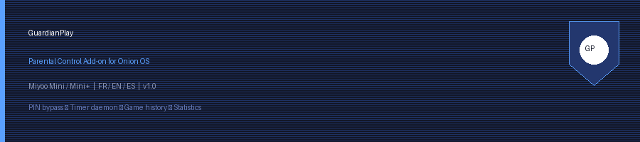

# 🛡️ GuardianPlay — Parental Control for Onion OS

> **Gérez le temps de jeu de vos enfants sur Miyoo Mini / Mini+**  
> *Manage your children's play time on Miyoo Mini / Mini+*

<div align="center">



[](https://github.com/OnionUI/Onion)
[](https://miyoo.com)
[](LICENSE)
[]()
[]()

</div>

---

## 📖 Table des matières / Table of Contents

- [🇫🇷 Description (Français)](#-description-français)
- [🇬🇧 Description (English)](#-description-english)
- [✨ Fonctionnalités / Features](#-fonctionnalités--features)
- [📁 Structure du projet](#-structure-du-projet)
- [⚙️ Installation](#️-installation)
- [🎮 Utilisation / Usage](#-utilisation--usage)
- [🔧 Architecture technique](#-architecture-technique)
- [🌍 Langues supportées](#-langues-supportées)
- [📋 Fichiers de données](#-fichiers-de-données)
- [🐛 Dépannage / Troubleshooting](#-dépannage--troubleshooting)
- [🤝 Contribuer](#-contribuer)
- [📜 Licence](#-licence)

---

## 🇫🇷 Description (Français)

**GuardianPlay** est un add-on de contrôle parental complet pour **Onion OS**, le système d'exploitation custom pour les consoles **Miyoo Mini et Mini+**.

Il permet aux parents de :
- 🔒 **Protéger** l'accès à la configuration par un **code PIN à 4 chiffres**
- ⏱️ **Limiter** le temps de jeu quotidien
- 📢 **Alerter** l'enfant avec des pop-ups d'avertissement (10min, 5min, 1min restante)
- ⛔ **Bloquer** automatiquement le lancement d'un jeu si le temps est épuisé
- 📊 **Suivre** les statistiques de jeu par titre
- 📋 **Consulter** l'historique des 50 derniers lancements

---

## 🇬🇧 Description (English)

**GuardianPlay** is a full-featured parental control add-on for **Onion OS**, the custom operating system for **Miyoo Mini and Mini+** handheld consoles.

Parents can:
- 🔒 **Protect** the settings with a **4-digit PIN code**
- ⏱️ **Limit** daily play time
- 📢 **Alert** the child with in-game overlay warnings (10min, 5min, 1min left)
- ⛔ **Block** game launches automatically when time runs out
- 📊 **Track** per-game play statistics
- 📋 **Browse** the history of the last 50 game launches

---

## ✨ Fonctionnalités / Features

| Fonctionnalité | Détail |
|---|---|
| 🔒 **PIN à 4 chiffres** | Protège toute la configuration. Stocké en clair sur la SD (récupérable depuis un PC). |
| ⏱️ **Minuterie intelligente** | Ne décompte **que pendant le jeu** — pas dans les menus Onion OS. |
| 💾 **Persistance** | Le temps restant est sauvegardé toutes les 10 secondes sur la carte SD. |
| ⛔ **Blocage de lancement** | Empêche tout lancement de ROM si le temps est épuisé. |
| 📢 **Pop-ups en jeu** | Alertes à **10 min**, **5 min**, **1 min** restante (via infoPanel). |
| 🔴 **Arrêt forcé** | Le jeu est fermé automatiquement à 0 seconde. Retour au menu principal. |
| ➕ **Gestion du temps** | Ajout / retrait de +10min, +1h, +2h, +3h, -10min, -1h, -2h, remise à zéro. |
| 📊 **Statistiques** | Temps cumulé par jeu, tri par les plus joués. |
| 📋 **Historique** | 50 derniers lancements avec date/heure, pagination. Limite 500 Mo auto-rotation. |
| 🌍 **3 langues** | Français 🇫🇷, Anglais 🇬🇧, Espagnol 🇪🇸 — détection automatique via Onion OS. |

---

## 📁 Structure du projet

```
guardianplay-onion/
│
├── 📄 README.md                    ← Ce fichier
├── 📄 INSTALL.md                   ← Guide d'installation détaillé
├── 📄 LICENSE                      ← Licence MIT
│
├── 📂 src/
│   └── 📂 App/
│       └── 📂 ParentalControl/     ← Contenu à copier sur la SD
│           │
│           ├── 📄 config.json      ← Métadonnées de l'app (Onion OS)
│           ├── 📄 launch.sh        ← Lanceur de l'interface
│           │
│           ├── 📄 parental_ui.sh   ← Interface utilisateur principale (3 onglets)
│           ├── 📄 parental_daemon.sh ← Démon timer (tourne en arrière-plan)
│           ├── 📄 parental_hook.sh ← Hook de blocage (appelé avant chaque jeu)
│           │
│           ├── 📄 install.sh       ← Installeur automatique
│           ├── 📄 uninstall.sh     ← Désinstalleur
│           │
│           ├── 📂 lang/
│           │   ├── 📄 fr.sh        ← Traductions françaises
│           │   ├── 📄 en.sh        ← Traductions anglaises
│           │   └── 📄 es.sh        ← Traductions espagnoles
│           │
│           ├── 📂 res/
│           │   ├── 🎨 guardianplay.png   ← Icône app (96x96 PNG)
│           │   └── 📄 create_icon.py     ← Script de génération d'icône
│           │
│           └── 📂 data/            ← Créé automatiquement au 1er lancement
│               ├── 📄 config.cfg   ← PIN + état + temps restant
│               ├── 📄 stats.csv    ← Statistiques par jeu
│               └── 📄 history.log  ← Historique des lancements
│
└── 📂 docs/
    └── 📂 screenshots/             ← Captures d'écran
```

---

## ⚙️ Installation

### Prérequis
- 🎮 Miyoo Mini ou Mini+
- 📦 Onion OS **4.3 ou supérieur**
- 💾 Accès à la carte SD (depuis un PC)

### Étapes

#### 1️⃣ Copier les fichiers

Copiez le dossier `src/App/ParentalControl` sur votre carte SD :

```
📁 SD Card
└── 📂 App/
    └── 📂 ParentalControl/    ← Copier ici
        ├── config.json
        ├── launch.sh
        ├── parental_ui.sh
        ├── parental_daemon.sh
        ├── parental_hook.sh
        ├── install.sh
        ├── uninstall.sh
        ├── lang/
        └── res/
```

#### 2️⃣ Copier l'icône

```
📁 SD Card
└── 📂 Icons/
    └── 📂 Default/
        └── 📂 app/
            └── 🎨 guardianplay.png   ← Copier ici
```

#### 3️⃣ Lancer l'installeur

Sur votre Miyoo Mini, ouvrez le **Terminal** depuis le menu Apps et exécutez :

```sh
sh /mnt/SDCARD/App/ParentalControl/install.sh
```

Ou via SSH / connexion FTP :

```sh
ssh root@<ip_miyoo>
sh /mnt/SDCARD/App/ParentalControl/install.sh
```

#### 4️⃣ Redémarrer

Redémarrez votre Miyoo Mini. GuardianPlay apparaîtra dans le menu **Apps** 🎉

> 💡 **Astuce** : Le script d'installation :
> - Patche automatiquement `runtime.sh` avec un hook sécurisé
> - Installe le démon de timer au démarrage
> - Crée un backup de `runtime.sh` (`runtime.sh.gp_backup`)

### Désinstallation

```sh
sh /mnt/SDCARD/App/ParentalControl/uninstall.sh
```

---

## 🎮 Utilisation / Usage

### Premier lancement — Création du PIN

Au premier lancement, GuardianPlay vous invite à créer un **code PIN à 4 chiffres**.

```
┌─────────────────────────────────┐
│ 🛡️ Bienvenue dans GuardianPlay! │
│                                 │
│  Créez un code PIN à 4 chiffres │
│  pour sécuriser le contrôle     │
│  parental.                      │
└─────────────────────────────────┘
     [ Digit 1/4 ]  0 1 2 3 4...
```

### Menu principal

```
┌─────────────────────────────────┐
│ 🛡️ GuardianPlay                 │
│ Statut: ACTIF  |  Restant: 1h   │
├─────────────────────────────────┤
│  ⚙  Paramètres                 │
│  📊 Statistiques                │
│  📋 Historique                  │
│  ℹ  À propos                   │
└─────────────────────────────────┘
```

### ⚙️ Onglet Paramètres

| Action | Description |
|--------|-------------|
| 🔒 Activer / 🔓 Désactiver | Bascule le contrôle parental (PIN requis) |
| 🔑 Modifier le PIN | Change le code PIN (PIN actuel requis) |
| ➕ Ajouter du temps | +10min / +1h / +2h / +3h |
| ➖ Retirer du temps | -10min / -1h / -2h / remise à zéro |

### 📊 Onglet Statistiques

Affiche le **temps cumulé par jeu**, trié du plus joué au moins joué.

```
📊 Statistiques de jeu
─────────────────────────────────
Temps total : 12h 34min

Top jeux :
1. Super Mario World — 3h 15min
2. Sonic the Hedgehog — 2h 40min
3. Pokemon Red — 1h 55min
...
```

### 📋 Onglet Historique

Affiche les **50 derniers lancements** avec date/heure, paginés par 10.

```
📋 Historique  (Page 1/5)
─────────────────────────────────
1. [2024-01-15 18:32] Mario Bros
2. [2024-01-15 17:10] Zelda
3. [2024-01-14 20:05] Sonic
...
```

### 📢 Notifications en jeu (overlay)

| Moment | Message |
|--------|---------|
| 10 min restantes | ⚠️ Plus que 10 minutes de jeu ! |
| 5 min restantes | ⚠️ Attention : plus que 5 minutes ! |
| 1 min restante | 🔴 Dernière minute de jeu ! |
| 0 min | ⛔ Le jeu se ferme automatiquement |

### ⛔ Blocage de lancement

Si le temps est épuisé et qu'un enfant tente de lancer un jeu :

```
┌─────────────────────────────────┐
│ ⛔ Temps de jeu épuisé          │
│                                 │
│  Plus de temps de jeu           │
│  disponible.                    │
│  Demandez l'autorisation        │
│  à un parent.                   │
└─────────────────────────────────┘
```

---

## 🔧 Architecture technique

### Composants

| Fichier | Rôle |
|---------|------|
| `parental_ui.sh` | Interface graphique (utilise `prompt` et `infoPanel` d'Onion OS) |
| `parental_daemon.sh` | Démon background — timer, détection de jeu, notifications |
| `parental_hook.sh` | Hook pré-lancement — bloque si temps = 0 |
| `install.sh` | Patcheur de `runtime.sh` + installation du script de démarrage |

### Flux d'exécution

```
Boot
  │
  ├─ runtime.sh (Onion OS)
  │    └─ startup/guardianplay.sh ──► parental_daemon.sh (background)
  │
  │  [User launches a game]
  │
  ├─ runtime.sh :: launch_game()
  │    ├─ playActivity start "$rompath"
  │    ├─ [GUARDIANPLAY HOOK] parental_hook.sh "$rompath"
  │    │    └─ Si temps=0 ET activé → BLOQUE (exit 1)
  │    └─ $sysdir/cmd_to_run.sh  ← jeu lancé
  │
  │  [Game is running]
  │
  └─ parental_daemon.sh (polling every 1s)
       ├─ Détecte pgrep retroarch/ra32
       ├─ Décrémente GP_TIME_REMAINING
       ├─ @10min → infoPanel warning
       ├─ @5min  → infoPanel warning
       ├─ @1min  → infoPanel critical
       └─ @0s    → killall retroarch → retour menu
```

### Intégration Onion OS

- **Hook** : Injection dans `runtime.sh` après `playActivity start`
- **Démon** : Démarré via `$sysdir/startup/guardianplay.sh` (mécanisme EmuDeck-compatible)
- **UI** : Utilise les binaires natifs `prompt` et `infoPanel` de Onion OS
- **Données** : Stockées sur `/mnt/SDCARD/App/ParentalControl/data/`
- **Config PIN** : Lisible depuis un PC via la carte SD

---

## 🌍 Langues supportées

GuardianPlay détecte automatiquement la langue configurée dans Onion OS (`system.json`).

| Langue | Code Onion | Fichier |
|--------|-----------|---------|
| 🇫🇷 Français | `fr` / `french` | `lang/fr.sh` |
| 🇬🇧 English | `en` / `english` | `lang/en.sh` |
| 🇪🇸 Español | `es` / `spanish` | `lang/es.sh` |

---

## 📋 Fichiers de données

Tous les fichiers sont dans `/mnt/SDCARD/App/ParentalControl/data/` :

### `config.cfg`
```sh
GP_ENABLED_STATE=1        # 0=désactivé, 1=activé
GP_PIN=1234               # PIN en clair (lisible depuis PC)
GP_TIME_REMAINING=3600    # Secondes restantes
```

### `stats.csv`
```csv
Super Mario World,8100
Sonic the Hedgehog,9600
Pokemon Red,6900
```
Format : `nom_du_jeu,secondes_totales`

### `history.log`
```
2024-01-15 18:32:00|Super Mario World
2024-01-15 17:10:15|Sonic the Hedgehog
2024-01-14 20:05:30|Pokemon Red
```
Format : `YYYY-MM-DD HH:MM:SS|nom_du_jeu`

> ⚠️ Le fichier d'historique ne dépassera jamais **500 Mo** (rotation automatique).

---

## 🐛 Dépannage / Troubleshooting

### Le démon ne démarre pas
```sh
# Vérifier le log
cat /tmp/guardianplay_daemon.log

# Redémarrer manuellement
sh /mnt/SDCARD/App/ParentalControl/parental_daemon.sh &
```

### L'app n'apparaît pas dans le menu Apps
- Vérifiez que `config.json` est présent dans le dossier
- Vérifiez que l'icône est dans `/mnt/SDCARD/Icons/Default/app/`
- Faites un "Refresh" dans le menu Apps d'Onion

### Le hook ne bloque pas les jeux
```sh
# Vérifier que le patch est en place
grep "GUARDIANPLAY" /mnt/SDCARD/.tmp_update/runtime.sh

# Si absent, relancer l'installeur
sh /mnt/SDCARD/App/ParentalControl/install.sh
```

### Restaurer runtime.sh original
```sh
# Le backup est automatiquement créé par install.sh
cp /mnt/SDCARD/.tmp_update/runtime.sh.gp_backup \
   /mnt/SDCARD/.tmp_update/runtime.sh
```

### J'ai oublié mon PIN
Le PIN est stocké en clair dans :
```
/mnt/SDCARD/App/ParentalControl/data/config.cfg
```
Ouvrez ce fichier depuis un PC et lisez/modifiez la ligne `GP_PIN=`.

---

## 🤝 Contribuer

Les contributions sont les bienvenues ! 

1. Fork le projet
2. Créez votre branche (`git checkout -b feature/ma-feature`)
3. Committez (`git commit -m 'feat: Ajouter ma super feature'`)
4. Push (`git push origin feature/ma-feature`)
5. Ouvrez une Pull Request

### Idées pour contributions futures
- [ ] 🌍 Support de langues supplémentaires (DE, IT, PT...)
- [ ] 📅 Plages horaires autorisées (ex: jeu autorisé uniquement de 16h à 18h)
- [ ] 👤 Profils multi-enfants
- [ ] 📱 Intégration Wi-Fi (notification sur téléphone parent)
- [ ] 🎮 Whitelist / blacklist de ROMs spécifiques

---

## 📜 Licence

Ce projet est sous licence **MIT**. Voir [LICENSE](LICENSE) pour plus de détails.

---

<div align="center">

Made with ❤️ for Miyoo Mini parents

**[⬆️ Retour en haut](#️-guardianplay--parental-control-for-onion-os)**

</div>
